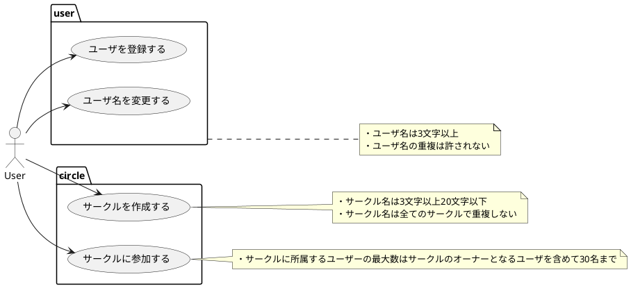

# bottom-up-ddd
「ドメイン駆動設計入門 ボトムアップでわかる」のコードをTypescriptで実践する

## 作るもの
###  SNSを題材としたユーザとサークルの機能
- ユースケース


## Project Init

```zsh
npm init -y
npm install typescript --save-dev
npm install @types/node --save-dev

npx tsc --init --rootDir src --outDir lib --esModuleInterop --resolveJsonModule --lib es6,dom --module commonjs

npm install ts-node --save-dev
npm install nodemon --save-dev

```